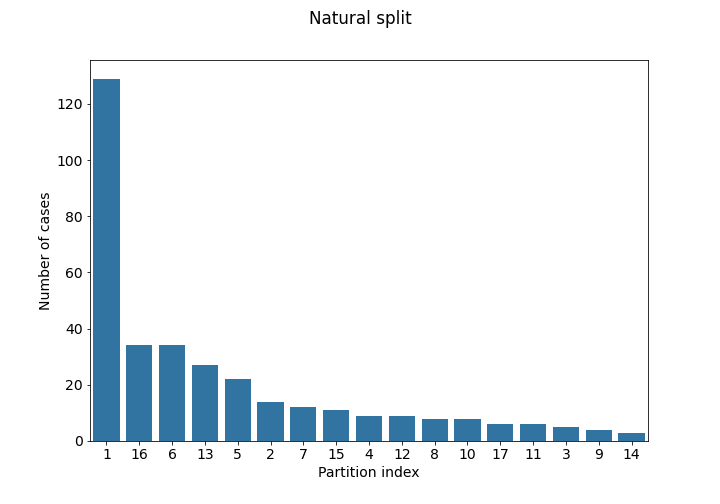
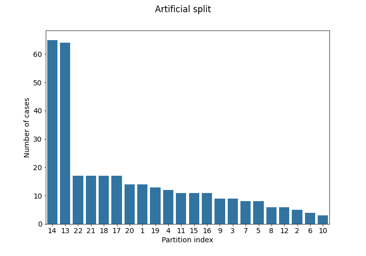

## Overview

Ample multi-institutional routine clinically-acquired pre-operative baseline multi-parametric Magnetic Resonance Imaging (mpMRI) scans of radiographically appearing glioblastoma (GBM) are provided as the training and validation data for the FeTS 2021 challenge. The data partitioning according to the acquisition origin will also be provided for the training data of the challenge. Specifically, the datasets used in the FeTS 2021 challenge are the subset of GBM cases from the BraTS 2020 challenge. Ground truth reference annotations are created and approved by expert board-certified neuroradiologists for every subject included in the training, validation, and testing datasets to quantitatively evaluate the performance of the participating algorithms.

**Validation data** will be released in June, through an email pointing to the accompanying leaderboard. This will allow participants to obtain preliminary results in unseen data and also report it in their **submitted papers**, in addition to their cross-validated results on the training data, and the implemented algorithm. The ground truth of the validation data will not be provided to the participants, but multiple submissions to the online evaluation platform ([CBICA's IPP](https://ipp.cbica.upenn.edu/)) will be allowed.

Finally, the algorithms of the participating teams with a valid short paper submission will be evaluated by the challenge organizers on the same **test data**, which will not be made available to the participants. Please note that the testing data will be a subset of the BraTS 2020 testing data, as well as data offered by independent geographically distinct institutions that participated in the FeTS federation. The top-ranked participating teams will be invited to prepare their slides for a short oral presentation of their method during the FeTS satellite event at MICCAI 2021.

## Imaging Data Description

All FeTS mpMRI scans are available as NIfTI files (.nii.gz) and describe a) native (**T1**) and b) post-contrast T1-weighted (**T1Gd**), c) T2-weighted (**T2**), and d) T2 Fluid Attenuated Inversion Recovery (**T2-FLAIR**) volumes, and were acquired with different clinical protocols and various scanners from multiple institutions, mentioned as data contributors here.

All the imaging datasets have been segmented manually, by one to four raters, following the same annotation protocol, and their annotations were approved by experienced neuro-radiologists. Annotations comprise the GD-enhancing tumor (**ET — label 4**), the peritumoral edematous/invaded tissue (**ED — label 2**), and the necrotic tumor core (**NCR — label 1**), as described both in the [BraTS 2012-2013 TMI paper](http://dx.doi.org/10.1109/TMI.2014.2377694) and in the [latest BraTS summarizing paper](https://arxiv.org/abs/1811.02629). The provided data are distributed after their pre-processing, i.e., co-registered to the same anatomical template, interpolated to the same resolution (1 mm3) and skull-stripped.

## Non-Imaging Data Description

The imaging data are accompanied by a comma-separated value (.csv) file including information of the data partitioning according to the acquisition origin for each of the pseudo-identified imaging data, to further facilitate research on FL.
The imaging data is complemented by comma-separated value files (.csv) that include information on the data partitioning according to the acquisition origin for each of the pseudo-identified imaging data, to further facilitate research on FL. We provide two strategies to partition the data:

1. **Natural partitioning by institution:** (file: `partitioning_1.csv`) Each institution ID represents the originating institution.
2. **Artificial partitioning using imaging information** (file: `partitioning_2.csv`) This is same as the institution split, but after further partitioning each of the 5 largest institutions according to the information extracted from the images. Specifically, after measuring the whole tumor size for all records, the median size was used as threshold to create extra partitions.

We encourage participants to create and explore further partitioning strategies using any information they would feel is relevant, to contribute towards the generalizability of their proposed method. For task 2, however, the natural partitioning (1) may be more relevant, as each originating institution in the test set will also be associated to one "test domain".

The case numbers in each partition of the *training set* are visualized below:

<!-- Furthermore, since FeTS leverages the BraTS 2020 data, information on the overall survival (OS), defined in days, are included in a csv file with correspondences to the pseudo-identifiers of the imaging data. The .csv file also includes the age of patients, as well as the resection status. Note that all these data are complementary and not required for the FeTS challenge. -->

## Use of Data Beyond FeTS

Participants are **NOT allowed to use additional public and/or private data** (from their own institutions) for extending the provided data. Similarly, using models that were pretrained on such datasets is NOT allowed. This is due to our intentions to provide a fair comparison among the participating methods.

## Data Usage Agreement and Citations

You are free to use and/or refer to the FeTS datasets in your own research, provided that you always cite the following three manuscripts:

\[1\] [S. Pati, U. Baid, M. Zenk, B. Edwards, M. J. Sheller, G. A. Reina, et al., "The Federated Tumor Segmentation (FeTS) Challenge", arXiv preprint arXiv:2105.05874 (2021)](https://arxiv.org/abs/2105.05874)

\[2\] [G.A.Reina, A.Gruzdev, P.Foley, O.Perepelkina, M.Sharma, I.Davidyuk, et al., “OpenFL: An open-source framework for Federated Learning”, arXiv preprint arXiv:2105.06413 (2021)](https://arxiv.org/abs/2105.06413)

\[3\] [S. Bakas, H. Akbari, A. Sotiras, M. Bilello, M. Rozycki, J.S. Kirby, et al., "Advancing The Cancer Genome Atlas glioma MRI collections with expert segmentation labels and radiomic features", Nature Scientific Data, 4:170117 (2017) DOI: 10.1038/sdata.2017.117](https://www.ncbi.nlm.nih.gov/pubmed/28872634)

Additionally, the manuscript below contains results of a simulated study directly related to the FeTS challenge.

[4] [M.J.Sheller, B.Edwards, G.A.Reina, J.Martin, S.Pati, A.Kotrotsou, et al., "Federated learning in medicine: facilitating multi-institutional collaborations without sharing patient data", Nature Scientific Reports, 10:12598 (2020)   DOI: 10.1038/s41598-020-69250-1](https://www.nature.com/articles/s41598-020-69250-1)

Finally, the following is a data citations directly referring to the TCGA-GBM and TCGA-LGG collections used as part of the FeTS dataset.

[5] [S. Bakas, H. Akbari, A. Sotiras, M. Bilello, M. Rozycki, J. Kirby, et al., "Segmentation Labels and Radiomic Features for the Pre-operative Scans of the TCGA-GBM collection", The Cancer Imaging Archive, 2017. DOI: 10.7937/K9/TCIA.2017.KLXWJJ1Q](https://doi.org/10.7937/K9/TCIA.2017.KLXWJJ1Q)

[6] [S. Bakas, H. Akbari, A. Sotiras, M. Bilello, M. Rozycki, J. Kirby, et al., "Segmentation Labels and Radiomic Features for the Pre-operative Scans of the TCGA-LGG collection", The Cancer Imaging Archive, 2017. DOI: 10.7937/K9/TCIA.2017.GJQ7R0EF](https://doi.org/10.7937/K9/TCIA.2017.GJQ7R0EF)

*Note:* Use of the FeTS datasets for creating and submitting benchmark results for publication on MLPerf.org is considered non-commercial use. It is further acceptable to republish results published on MLPerf.org, as well as to create unverified benchmark results consistent with the MLPerf.org rules in other locations. Please note that you should always adhere to the FeTS data usage guidelines and cite appropriately the aforementioned publications, as well as to the terms of use required by MLPerf.org.
