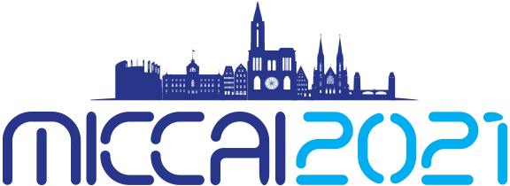
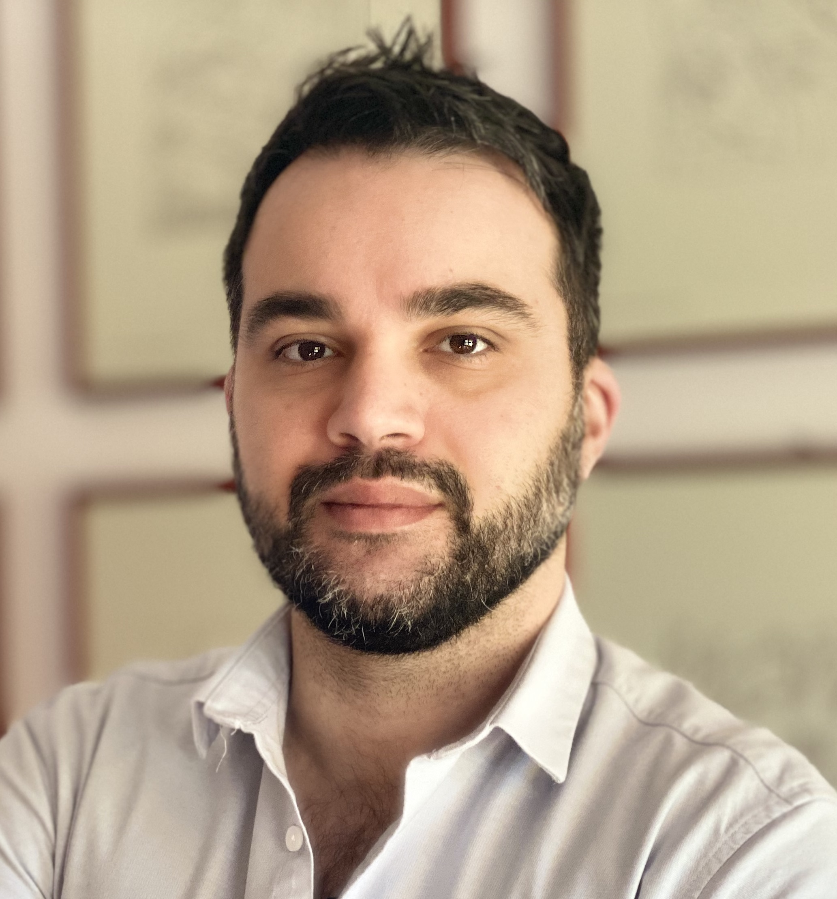
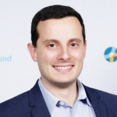

<!--  -->

### Keynote 1: Alexandros Karargyris, Ph.D

<!--  -->

**Title (tentative):** Introducing the MLCommons Medical Accuracy group

**Bio:** Alexandros Karargyris is a senior researcher at the Institute of Image-Guided Surgery of Strasbourg, a unique place for translative clinical research. He is leading projects related to applications in the intersection of surgery and artificial intelligence (AI). Previously, he worked as a researcher at IBM and NIH for more than 10 years. His research interests lie in the space of medical imaging, machine learning and mobile health. He has contributed to healthcare commercial products and imaging solutions deployed in under-resourced areas. His work has been published in peer-reviewed journals and conferences.

### Keynote 2: Renato Umeton, Ph.D

**Title (tentative):** The MLCommons Multi-Site Cancer Research Initiative

**Bio:** Renato studied computer science for both Master’s and Bachelor’s, after that he got a Ph.D. in Mathematics and Informatics defending a thesis on Optimization and Ontology for Computational and Systems Biology, which brought him to work first at Microsoft and then at Massachusetts Institute of Technology. More recently he complemented the leadership skills acquired in the field with additional Executive Education training at Harvard Extension School. Currently Renato serves as Associate Director of Artificial Intelligence Operations and Data Science Services in the Informatics & Analytics department of Dana-Farber Cancer Institute, a teaching affiliate of Harvard Medical School. He accrued 15 years of experience across artificial intelligence, data science, and big data working in other hospitals, in academia, in consulting, and in industry, where he operated in roles spanning from postdoc to director. In those contexts, he worked on several scientific publications and patents, some of which were leveraged in clinical trials and others were licensed to commercial companies. As of July 2021, Renato co-authored 90+ scientific publications, 6+ patent applications, and he is currently affiliated also with MIT, Harvard T.H. Chan School of Public Health, and Weill Cornell Medicine. Renato also participates in various data science industry collaborations that aim at democratizing and expanding the reach of artificial intelligence and machine learning in healthcare and digital pathology. In addition to his main responsibilities, he is/has been: (i) reviewer for various journals by Nature Publishing Group, IEEE, ACM, and Oxford Press among the others, (ii) invited speaker at venues ranging from a department of the US Federal Government to multiple Fortune 20 companies and numerous world-renowned academic medical centers, (iii) chair/organizer of several machine learning and AI conferences and groups, (iv) mentor to 50+ mentees through programs that spanned from bootcamp to MD/PhD degree, and (v) manager for a global group of machine learning professionals counting 80,000+ members world-wide.
